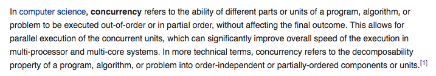
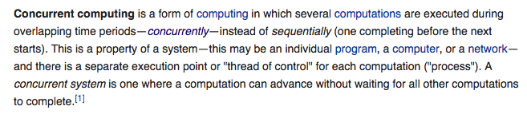
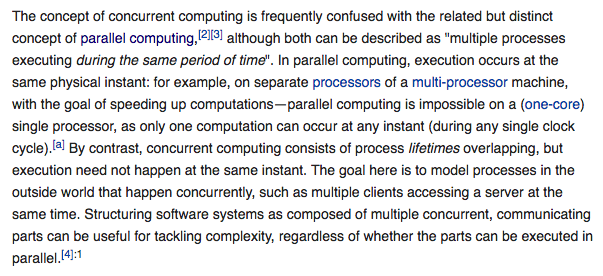
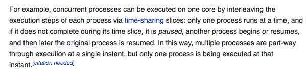
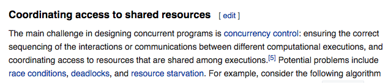
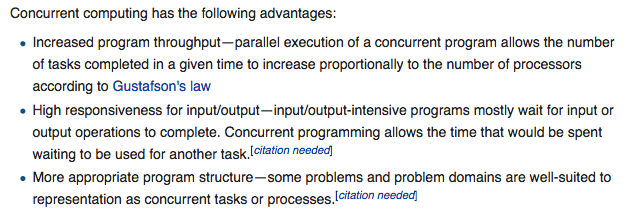
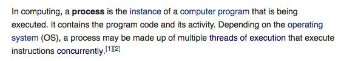
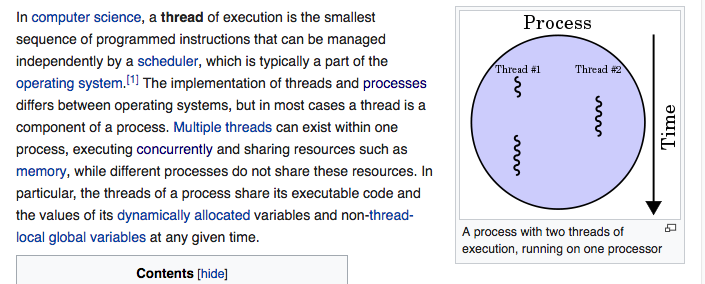
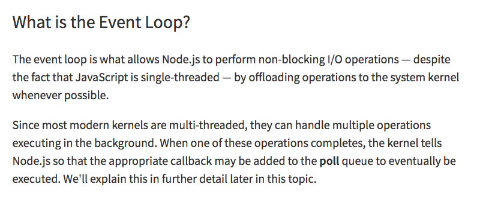

#### What is Concurrency

##### To note:
 - Units of program // functions
 - Executed out-of-order
 - Without affecting the final outcome

> In technical terms, concurrency refers to **decomposability** of the program into
> **order-independent units**

These independent-units has the ability to run Parallel on a multi-processor/multi-core
systems which can improve the overall speed of the execution  

Also these independent-units can be *interleaved* with one another and can run on a
single thread which still can improve the overall speed, and conserve the resources

Source: https://en.wikipedia.org/wiki/Concurrency_(computer_science)

#### Concurrent Computing

To note:
- Overlapping time periods
- there is a separate execution point or "thread of control" for each computation("process")

> A concurrent systems is one where computation can *advance* without waiting for all
other computations to complete

##### Concurrent Computing vs Parallel Computing


> The goal here is to model processes(programs) in the outside world that happen concurrently



##### Challenges in Concurrent Computing

We should take care of Ordering of the process, without affecting the final outcome

##### Advantages of Concurrent Computing



#### Process

#### Threads


#### Summarising
> Concurrency is the decomposability property of the program into order-independent-units/computations/process

> Concurrent computing is where these order-independent units are
interleaved over a period of time

Usually the independent units are assigned a thread, and these
threads are interleaved to achieve concurrency

consider the below code
```
var a = 20;

function foo() {
	a = a + 1;
}

function bar() {
	a = a * 2;
}

ajax( "http://some.url.1", foo );
ajax( "http://some.url.2", bar );
```
computational units here are foo() and bar().  
They are order independent and can execute independently.  
Note: Order independent does not they don't share the same resource !

In a typical programming environment, foo() and bar() are assigned threads *Thread_1* and *Thread_2*

We know that a thread can pause, resume and interleave with other thread processes as
shown in the figure above.

```
Thread 1 (X and Y are temporary memory locations):

foo():
  a. load value of `a` in `X`
  b. store `1` in `Y`
  c. add `X` and `Y`, store result in `X`
  d. store value of `X` in `a`
Thread 2 (X and Y are temporary memory locations):

bar():
  a. load value of `a` in `X`
  b. store `2` in `Y`
  c. multiply `X` and `Y`, store result in `X`
  d. store value of `X` in `a`
```

Now, let's say that the two threads are running truly in parallel. You can probably spot the problem, right? They use shared memory locations X and Y for their temporary steps.

What's the end result in a if the steps happen like this?

```
1a  (load value of `a` in `X`   ==> `20`)
2a  (load value of `a` in `X`   ==> `20`)
1b  (store `1` in `Y`   ==> `1`)
2b  (store `2` in `Y`   ==> `2`)
1c  (add `X` and `Y`, store result in `X`   ==> `22`)
1d  (store value of `X` in `a`   ==> `22`)
2c  (multiply `X` and `Y`, store result in `X`   ==> `44`)
2d  (store value of `X` in `a`   ==> `44`)
```
The result in a will be 44. But what about this ordering?

```
1a  (load value of `a` in `X`   ==> `20`)
2a  (load value of `a` in `X`   ==> `20`)
2b  (store `2` in `Y`   ==> `2`)
1b  (store `1` in `Y`   ==> `1`)
2c  (multiply `X` and `Y`, store result in `X`   ==> `20`)
1c  (add `X` and `Y`, store result in `X`   ==> `21`)
1d  (store value of `X` in `a`   ==> `21`)
2d  (store value of `X` in `a`   ==> `21`)
```
The result in a will be 21.

There can be many possibilities, exhibiting *Non-determinism*. This is not preferred.

This can be overcome by using thread synchronisation, locking state

Problems
  - Threads starving. Threads wait for a resource to get released
  - Resource Sharing. If threads are not controlled properly they lead to unwanted mutations. Non-determinism
  - Ordering - Thread synchronisation

## How js does concurrent computation?

Now instead of assigning threads for each computation units and
interleave them within a process,  
JS  takes these *computation units* and *interleaves* them in a **event-queue** and has its *single
thread* execute whatever tasks in the event-queue with *run-to-completion* behaviour.  
The order in which the computation units/tasks/processes are interleaved depends on the Environment/kernel which is a Multi-threaded environment.

Here we have,
- Threads are not starved
- Resource sharing between multiple threads is not possible // Single thread, run-to-completion
- Ordering is at computation unit/function level rather than operation level

In order to combat the Ordering problem, js has control over the
event-queue and can execute in the preferred order.// Promises

## Analogy
A Restaurant with Multiple Tables with each table assigned a Waiter and a Kitchen to cook food

- Restaurant  - Process  
- Table       - Tasks/computation unit/processes
- Waiter      - Thread
- Kitchen     - Environment/Kernel which is multi threaded

In JS world,
A Restaurant with Multiple Tables served by One Waiter and Kitchen. Along with
this we have *Event-loop guy who interleaves task for the Waiter*

EventLoop has Event-queue , pushes tasks from queue to CallStack  

Waiter is a Single threaded, Run-to-completion guy. He has a CallStack and
does whatever is in the CallStack. FIFO

Scenario,  
A table place a order request on the CallStack which is executed by the waiter, Knowing that it is a cook order it gives the Order to the Kitchen and waits other
table requests.
The Kitchen which is multi-threaded, process the order and when done registers a
callback on the event-queue managed by the event-loop

The Event loop checks the Waiter's CallStack, if empty, performs a tick, takes the
first task and push it to Waiter's CallStack

The waiter then performs the run-to-completion




#### conjecture:
Java is single threaded by default. When it has a *concurrent program* or computation unit it creates a new thread and assigns it. This thread waits till it get back a
response from the kernel. When received it gets interleaved with other threads to complete its operations.
Since Java does not have Event-loop,Event-queue architecture it has to take care of concurrency problems thru thread synchronisation techniques.
