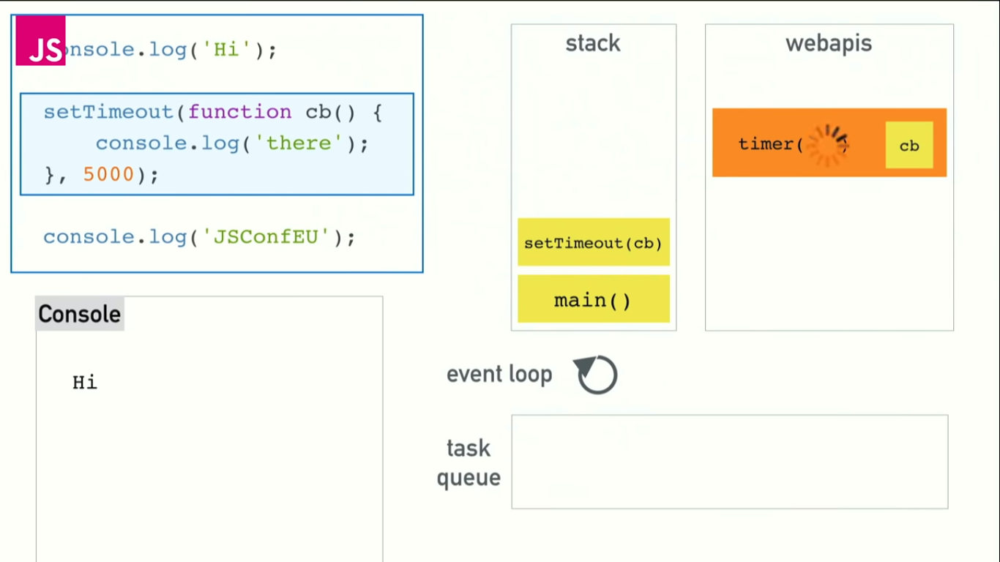
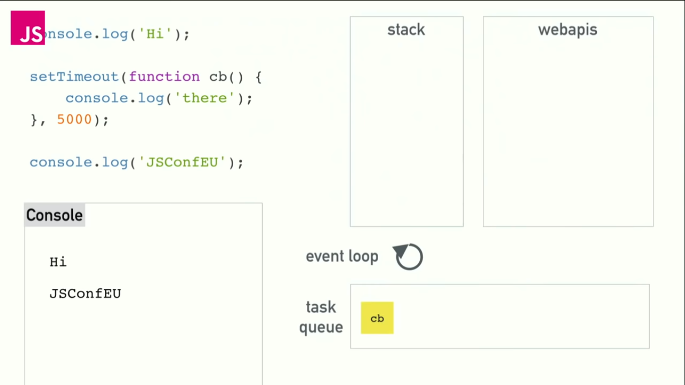
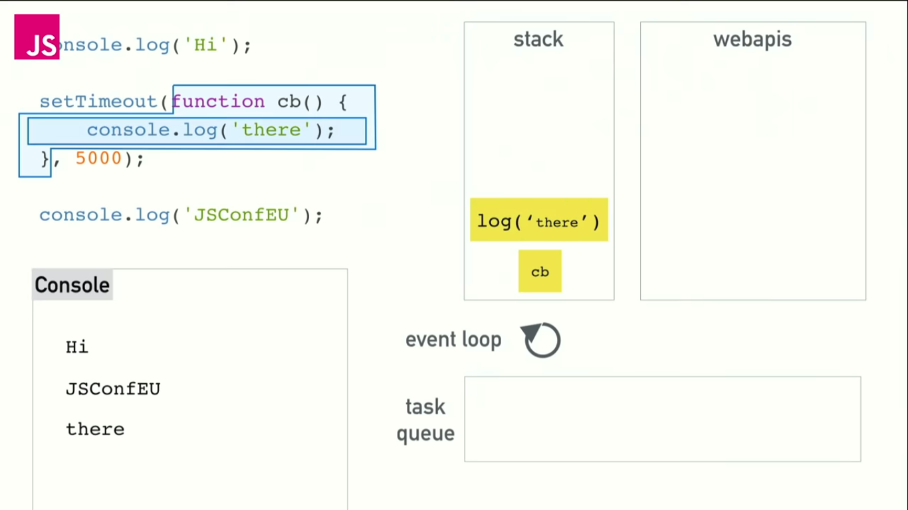

# Summary

### Event Loop

### Component

#### CallStack
A *Stack* of *function* where **JS Engine** will execute in FIFO (first-in-first-out) push-pop
Once all the functions in the stack are executed, meaning CallStack empty.  
The event-loop *tick* takes a *event* from **event-queue** and starts executing it  

#### Heap
Typical Object heap as a result of operation form CallStack functions

#### JS Engine
JS Engine is **Single-threaded**, *run to completion* engine
It *executes* whatever is present in the CallStack. Once executed it pops the item  
It *runs* to empty the stack
Note:  
JS Engine does not add/push *calls/functions* to the CallStack or handle events. It simply an execution engine
executing whatever functions in the CallStack

#### EventLoop
When the CallStack is empty, the event-loop performs a *tick*.
Ie., it takes a *item* from the **event-queue** and push it to the CallStack

#### JS Environment
JS Environment can be
  - Browser Environment
  - nodejs (server)

These environment can run concurrently(see what is concurrently below). Most of the I/O calls, timers, network
calls are handled by the environment and registers a callback in the **event-queue** once the operation is done.  
The handling of I/O calls etc can happen concurrently

