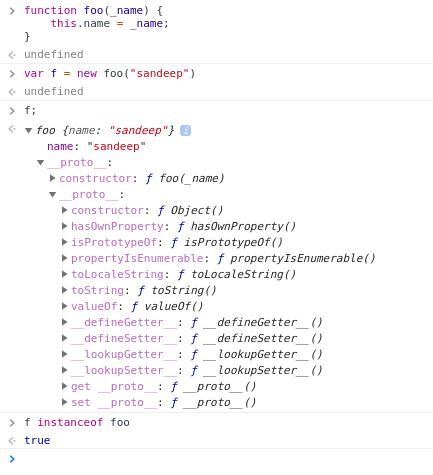
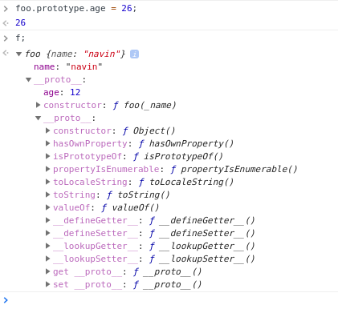
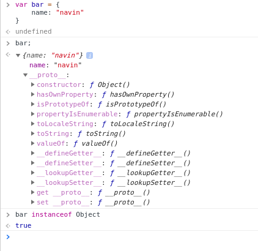

## Summary
JS has the most flexible and expressive *object* system with
- Prototypal inheritance
- Dynamic object extension
- Closures

Quick explanation :
// todo


## Creating Objects
Just like functions(see function-basics), Objects in js are created through
  - Constructor form // explicit, not preferred
  - literal form  // implicit

The above *form* along with the help of *functions* we can
create as many objects by invoking the function  

see: Built-in functions - types and grammar. for constructor form

### Construtor form
```
var employee = new Object();
employee.name = sandeep;
```

```
function Employee(_name) {
  this.name = _name;
}

var emp1 = new Employee("sandeep")
var emp2 = new Employee("navin")
```

Constructor form, creates a prototype object with the *constructor function ref*
and attaches it as the *immediate* prototype.




prototypes are available under `__proto__`  


We can add properties to the immediate prototype as shown



#### Note #1:
assigning a new prototype wont work, it fails silently. This behaviour
may be due to `Property Descriptors` making it immutable

```
foo.prototype = {} // nothing happens
```

#### Note #2: instanceOf
`instanceOf` operator checks for **constructor function** in the prototype
chain. If found it returns true.
wkt, *constructor function reference* is added by the `new` operator.  

For literals, they are *implicitly* created from **Object constructor function**
Hence they have *Object function ref*


### literal object aka singleton
```
var employee = {
  name: "sandeep"
}
```


object literals are *implicitly* created from the **Object built-in function**
So they have *Object constructor function ref* in their *prototype* chain  

> Also, similar to java, all objects has `Object` prototype in the top of the chain

To create many objects of that construct, we use functions

> wkt, local variables/bindings in a function are recreated every time when it is called.

```
function createEmployee(_name) {
  return {
    name: _name
  }
}

var emp1 = createEmployee("sandeep");
var emp2 = createEmployee("navin");
```

## Object properties
hasOwnProperty
getPrototypeOf

## Property Descriptors
// todo


##

// programming in js

> js is pass by value

Javascript Object System
  - Prototypal inheritance
  - Dynamic object extension
  - Closures

Everything in JS are objects
Primitive types are also treated as objects- Autoboxed when using dot notation

Classical Inheritance

Program to an interface, not an implementation
Favour object composition over class inheritance

Tight coupling
  - child is coupled to parent
  - child codes to parents implementation

Inflexible Heirachies
Heirachies acheived thru inheritance are not flexible and does not fit all use-cases

Multiple Inheritance

Brittle Architecture
Refactor

Gorilla banana :
copy of the parent


Constructing object with new keyword
How to construct objects in js - object literal
Singleton in objects


- Lambdas and closures
- object literal
- Dyanmic object extension
- Prototypes
- Factories
- Fluent apis // pure, chainable methods


Protoypes // object linking
  - Delagate to a prototype
  - Clone a prototype


Object creation
Encapsulation, closures, Factory

Stamps


Everything in JS in objects. This allows the language to
pass around anything

Function as objects
Built-in Functions
Constructing Object
  - literal
  - Functions

Autoboxing in js for primitives/ literal
immutable
Autoboxing

Properties on Object

Access
- .
- [] // computed

Arrays are objects

Duplicating objects

Property Descriptors
- Writable
- configurable
- Enumerable


<<<<<<< HEAD
class in general // copies
=======
class // blue prints
>>>>>>> origin/master
inheritance
polymorphism

behaviour // interfaces // polymorphism


Prototypes

Behavior delegation Pattern
// delegate prototypes
// prototype cloning
// Flyweight Pattern
// Object creation
// factories

Modularity // encapuslation // interface


Protoptypes

Behaviour delegation


Two forms
- literal form // preferred
- constructor form

## Language Types:
- string
- number
- boolean
- null
- undefined
- object // non-primitive or complex


> null is a primitive. The fact that `typeOf(null)` returns *object* is because of the **bug** in the language. Unfortunately
this is irreversible as too much code is dependent on it

## Built-in Functions

- String
- Number
- Boolean
- Object
- Function
- Array
- Date
- RegExp
- Error

These *Built-in functions* can be used as a *constructor* to get
a newly constructed object.


> Everything in JavaScript is an object.

Even these *Built-in Functions* acts as objects and have properties within them


## Note:
All **primitive types** are **immutable**. This is in contrast to Java where the language provides
us the option to create primitives either mutable, immutable.
Eg: StringBuffer() mutable.

```
val strLiteral = "im a string";
typeOf strLiteral; // "string"
strLiteral instanceOf String // false


val strObject = new String("im a string");
typeOf strObject; // "object"
strObject instanceOf String; // true

```

### Note : typeOf vs instanceOf
Both are keywords in JS.
typeOf returns the *type* as in *language types* see above
instanceOf returns the **Constructor Function** that is used to
construct the object.

See "Constructed Function"
In JS there in no **Constructor Function** that gives a Constructed object.
It can be only by making a function constructable by calling it
with `new` keyword which makes it a **Constructed Function**

Note: presence of `this` has no effect on making Constructed Functions
